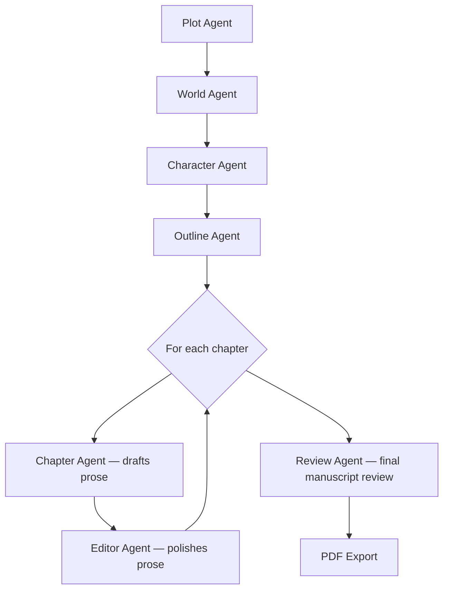

# 📖 Multi-Agent Novel Generator

A pipeline of specialized LLM agents that plans, writes, edits, and reviews a full-length novel from a single prompt — then compiles the result into a polished PDF manuscript, complete with a story bible, table of contents, and an AI editorial review.

## How it works



Each stage's output feeds the next: the plot defines the world, the world informs the characters, and the story bible built from all three grounds every chapter that gets written.

## Features

- **Multi-agent architecture** — dedicated LLM agents for plot, world-building, characters, outlining, drafting, editing, and review
- **Persistent story bible** — world, characters, plot threads, and chapter outlines are defined once and referenced throughout generation
- **Resumable runs** — progress is saved to SQLite after every chapter, so an interrupted run picks up where it left off instead of starting over
- **Continuity tracking** — rolling chapter summaries and active plot threads are passed forward so later chapters stay consistent with earlier ones
- **Structured outputs** — every agent response is validated against a Pydantic schema before use
- **Automatic retries** — failed API calls retry up to 3 times with backoff
- **Formatted PDF export** — title page, full story bible, table of contents, chapters, and editorial review, built with ReportLab

## Agent pipeline

| Agent | Model | Responsibility |
|---|---|---|
| Plot | `qwen/qwen3-235b-a22b` | Logline, themes, three-act structure, plot threads, turning points |
| World | `qwen/qwen3-235b-a22b` | Setting, time period, geography, society, rules, atmosphere |
| Character | `google/gemma-3-27b-it` | Protagonist, antagonist, and supporting cast with full arcs |
| Outline | `qwen/qwen3-235b-a22b` | Chapter-by-chapter outline, batched 5 chapters at a time |
| Chapter | `google/gemma-3-27b-it` | Full prose draft (3,500–5,000 words per chapter) |
| Editor | `mistralai/mistral-small-3.2-24b-instruct` | Line-editing pass — grammar, flow, voice consistency |
| Reviewer | `deepseek/deepseek-r1-0528` | Final manuscript review and 1–10 score |

All models run through [OpenRouter](https://openrouter.ai/), so any entry in `AGENT_MODELS` can be swapped for a different model available on the platform.

## Installation

```bash
git clone <your-repo-url>
cd <repo-folder>
pip install requests pydantic reportlab
```

**Requirements:** Python 3.9+, Pydantic ≥2.0 (uses `model_dump_json` / `model_validate_json`), and an [OpenRouter API key](https://openrouter.ai/keys).

## Usage

```bash
python novel_generator.py
```

You'll be prompted for:

- OpenRouter API key
- Novel title
- Genre
- Plot seed *(optional)*
- Character notes *(optional)*
- Number of chapters *(default: 25)*

The script then runs through story-bible generation, chapter-by-chapter writing and editing, a final review, and PDF export — with color-coded progress logs printed to the terminal the whole way through.

## Output

- **`<title>_novel.pdf`** — the finished manuscript: title page, story bible, table of contents, chapters, and editorial review
- **`novel_progress.db`** — a SQLite database storing the story bible, each chapter's content/summary/status, and a run log

Because progress is committed to SQLite after every chapter, you can safely stop the script mid-run and re-launch it later — it resumes from the last completed chapter rather than regenerating the whole book.

## A note on cost and time

A full run makes a lot of LLM calls: roughly 4 for the story bible (plus one per batch of 5 chapters for outlining), 2 per chapter (draft + edit), and 1 final review call. At the default of 25 chapters and up to 6,000 tokens per chapter, that's 50+ API calls and a non-trivial amount of OpenRouter credit and wall-clock time — the script includes deliberate pauses between calls to stay easy on the API, so budget accordingly.

## Project structure

```
.
├── novel_generator.py     # agents, database, PDF export, CLI orchestrator
├── novel_progress.db      # created on first run
└── <title>_novel.pdf      # created once a full run completes
```

## License

No license has been set yet — add one (MIT, Apache 2.0, etc.) before sharing this repo publicly.
